# Lab10 Notes

## GumballMachineV1 

* Feature Model
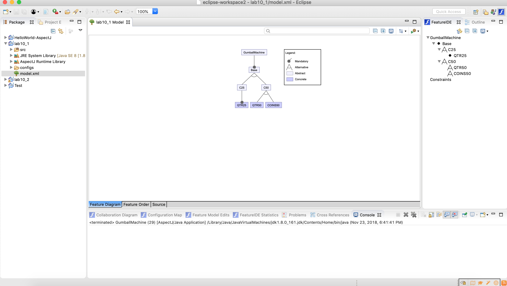

* Choose QTR 25
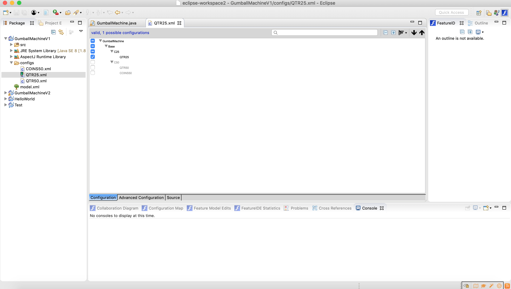
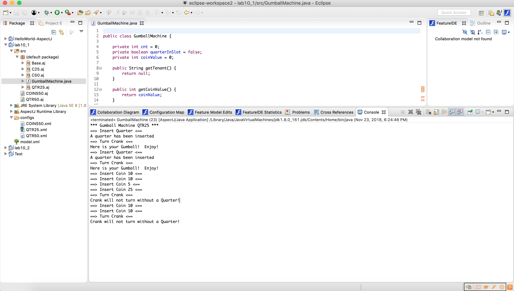

* Choose QTR 50
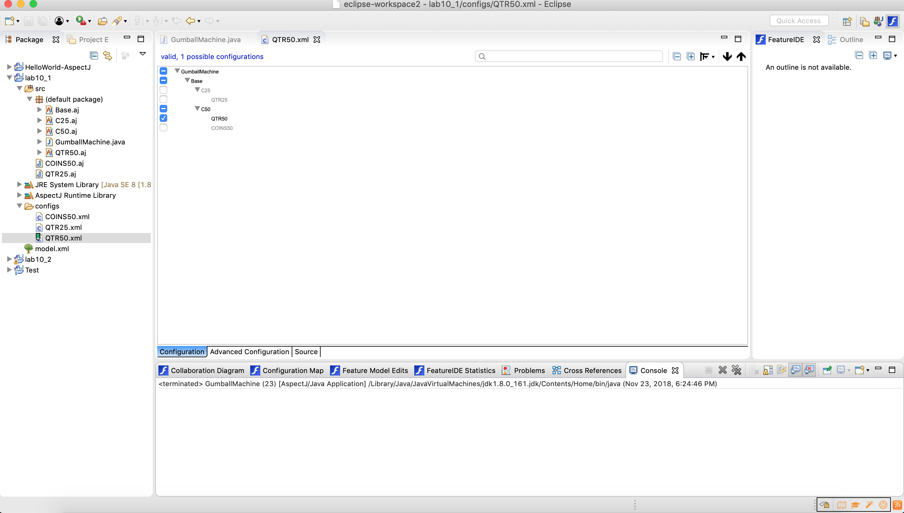
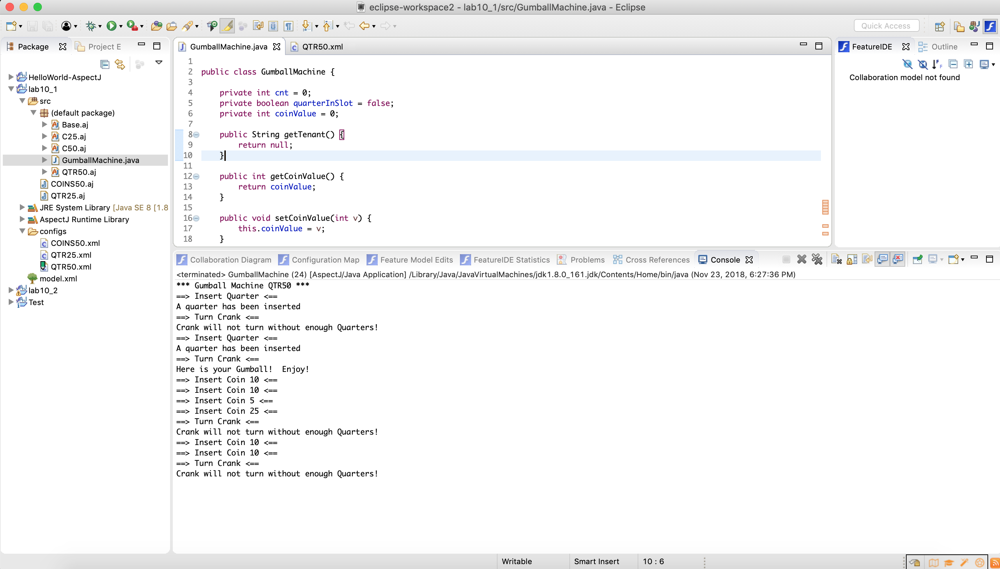

* Choose COINS 50

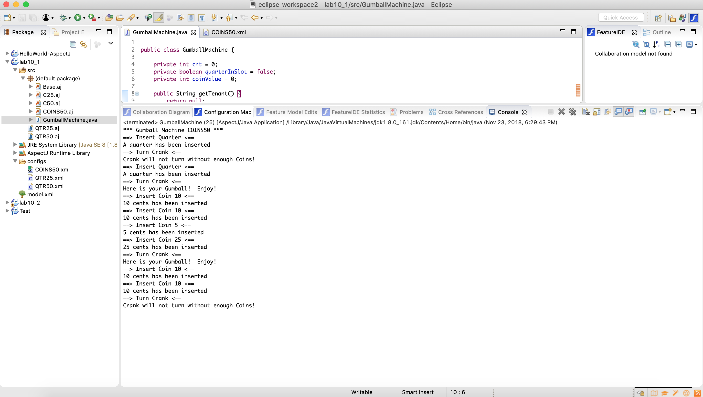

## GumballMachineV2

* Feature Model
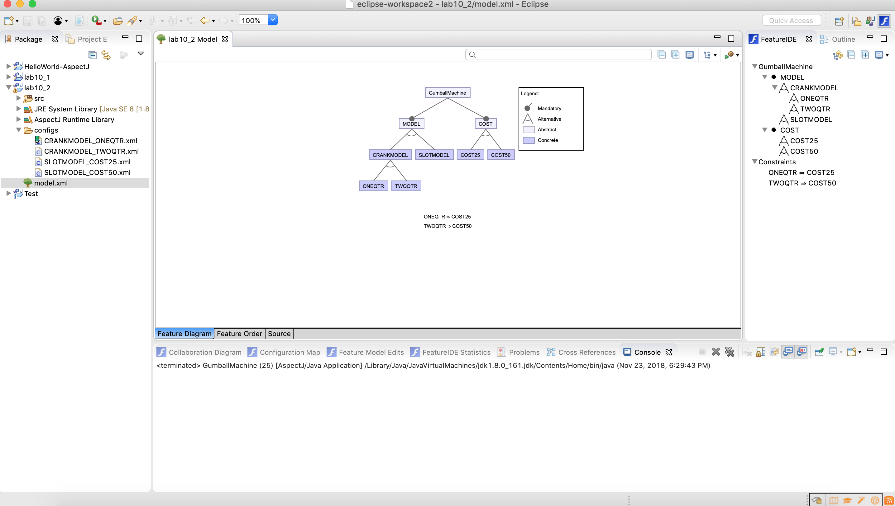

* Choose CRANKMODEL, ONEQTR, COST25
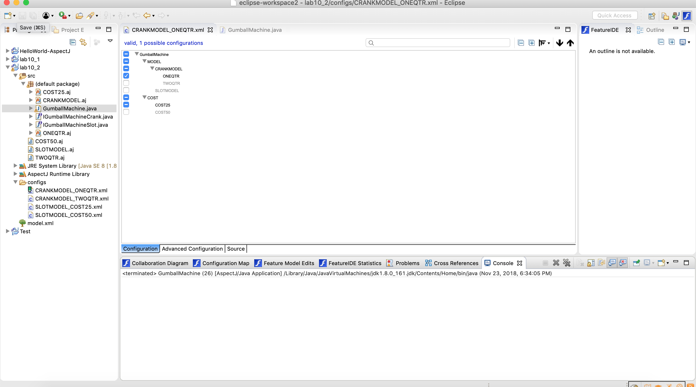
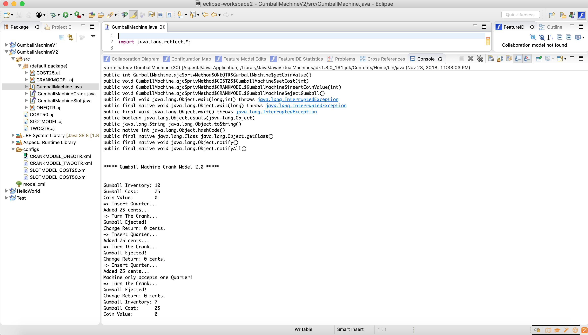

* Choose CRANKMODEL, TWOQTR, COST50
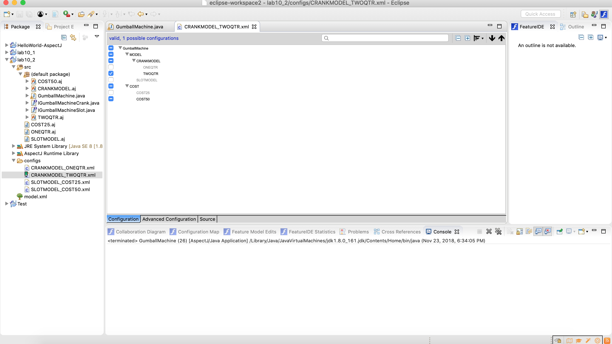
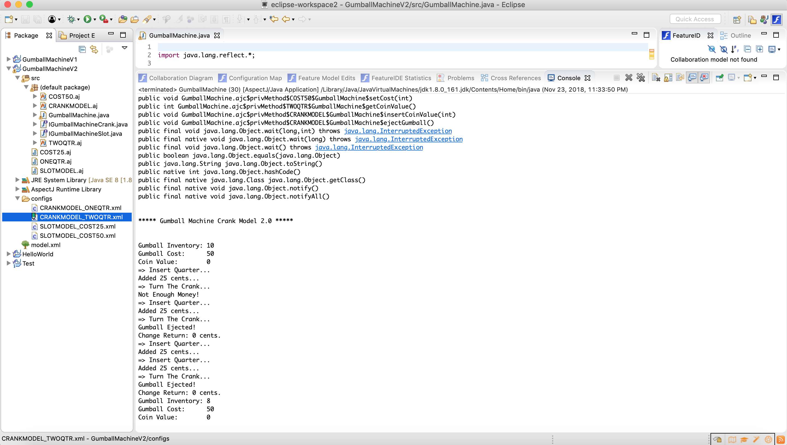

* Choose SLOTMODEL, COST25
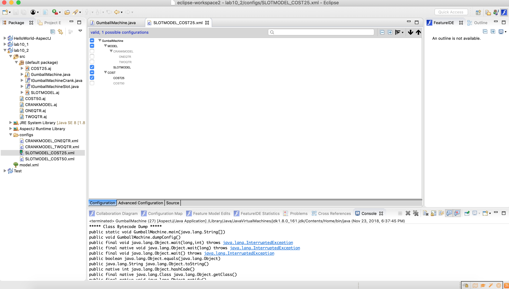
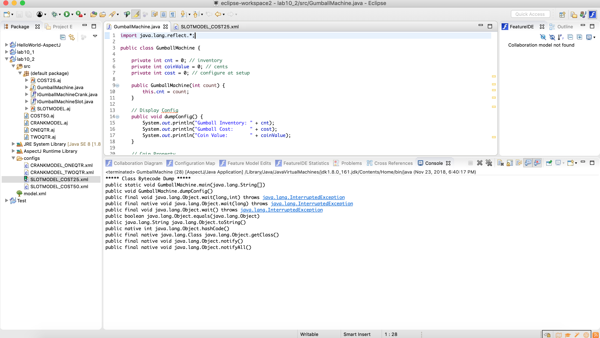

* Choose SLOTMODEL, COST50
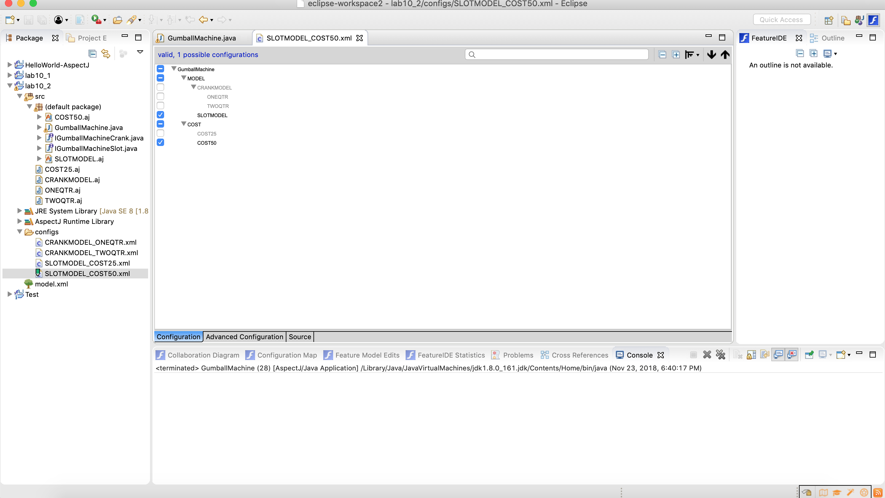
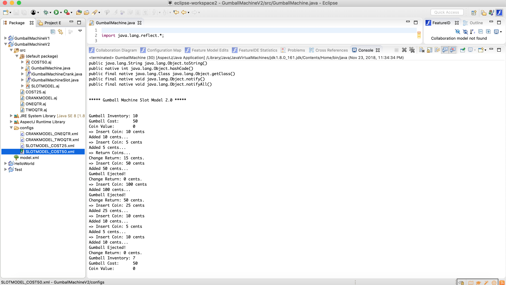

