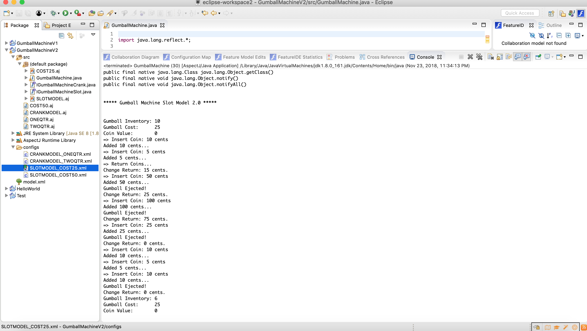

# Lab10 Notes

## GumballMachineV1 

* Feature Model

* Choose QTR 25

* Choose QTR 50

* Choose COINS 50

## GumballMachineV2

* Feature Model

* Choose CRANKMODEL, ONEQTR, COST25

* Choose CRANKMODEL, TWOQTR, COST50

* Choose SLOTMODEL, COST25

* Choose SLOTMODEL, COST50

